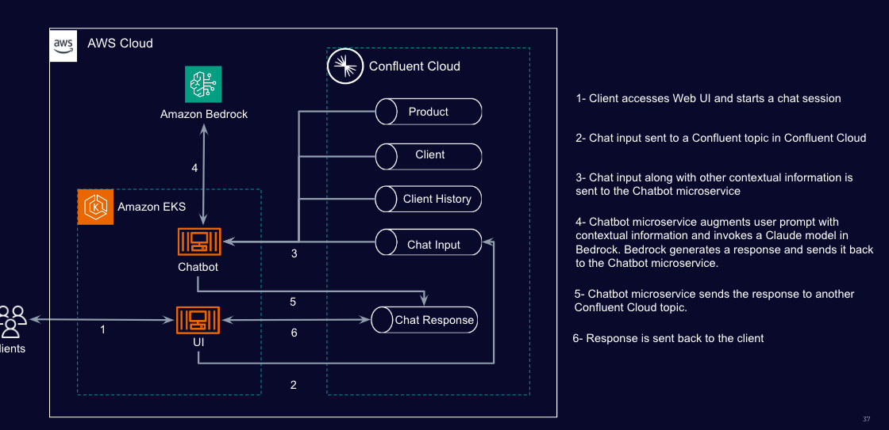
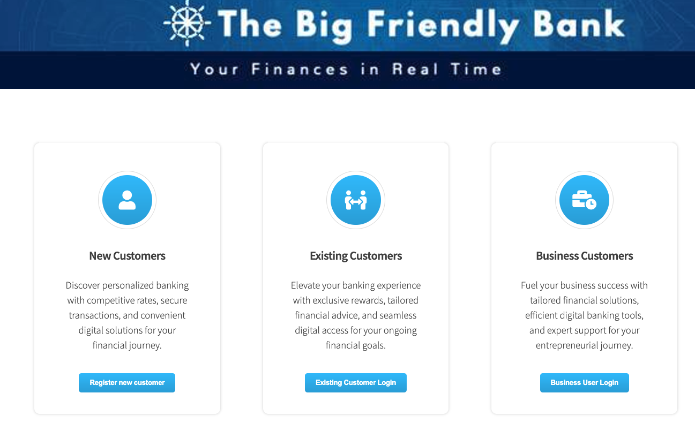

#  GenAI Chatbot for Informed Business Loan Specialists

This demo showcases how to use Confluent Cloud with Amazon Bedrock to build a chatbot powered by GenAI. Confluent Cloud enables real-time data freshness and supports the microservices paradigm. With Apache Kafka as its foundation, Confluent Cloud orchestrates the flow of information between various components.

First clone the repo onto your local development machine using `git clone <repo url>`.

## Architecture




## General Requirements

* **Confluent Cloud API Keys** - [Cloud API Keys](https://docs.confluent.io/cloud/current/access-management/authenticate/api-keys/api-keys.html#cloud-cloud-api-keys) with Organisation Admin permissions are needed to deploy the necessary Confluent resources.
* **Terraform (0.14+)** - The application is automatically created using [Terraform](https://www.terraform.io). Besides having Terraform installed locally, will need to provide your cloud provider credentials so Terraform can create and manage the resources for you.
* **AWS account** - This demo runs on AWS
* **AWS Region** - Demo runs on us-east-1
* **kubectl** - The demo uses kubectl to deploy the application.
* **[eksctl](https://eksctl.io/)** - Needed if you want to provision a new EKS cluster.
* **[HELM](https://helm.sh/)** - Needed for deploying the [AWS Loadbalancer Controller add-on](https://docs.aws.amazon.com/eks/latest/userguide/aws-load-balancer-controller.html)


## Pre-deployment Steps

Before deploying the demo, you need to set up the following components:

* **Confluent Cloud Cluster**: Create a Confluent Cloud cluster and obtain valid API keys. [Run this if you do not have an existing Confluen Cloud cluster.](#provision-confluent-cloud-resources)

* **Amazon EKS Cluster with the AWS Loadbalancer Controller Installed**: Ensure you have an existing Amazon EKS cluster set up. The demo relies on this cluster for deployment.[Run this to provison an Amazon EKS cluster.](#provision-Amazon-EKS-cluster)

### Provision Confluent Cloud Resources

We will use a Terraform script to deploy the following a Confluent Cloud Cluster and Cluster API Keys.

1. Change directory to demo repository and terraform directory.

```
cd csp-demo/Terraform

```
3. Use Terraform CLI to deploy solution

```
terraform plan

terraform apply

```

4. Get and store *<Confluent_bootstrap_endpoint>*, *<Confluent_API_key>* and *<Confluent_secret>* by running this command ```terraform output resource-ids```

### Provision Amazon EKS Cluster

1. If you do not have an EKS Cluster, create one using
  ```
eksctl create cluster --name <eks_cluster_name> --fargate

```

2. Create a Fragate profile

> Note: use csp-demo for name and namespace
 
```
eksctl create fargateprofile \
    --cluster <eks_cluster_name> \
    --name csp-demo \
    --namespace csp-demo
```

3. Create an IAM OIDC identity provider for your cluster with the following command.

```
eksctl utils associate-iam-oidc-provider --cluster <eks_cluster_name> --approve

```

4. Set kubectl context

```
aws eks update-kubeconfig --region us-east-1 --name <eks_cluster_name>
```

#### Install and configure the AWS Loadbalancer Controller

1. Controller needs IAM permissions to provision AWS resources. Run the following commands to create IAMService Account with the required permissions. Replace <AWS_Acccount_number> with the AWS account number,
   
```
curl -O https://raw.githubusercontent.com/kubernetes-sigs/aws-load-balancer-controller/v2.5.4/docs/install/iam_policy.json


aws iam create-policy \
    --policy-name AWSLoadBalancerControllerIAMPolicy \
    --policy-document file://iam_policy.json


eksctl create iamserviceaccount \
  --cluster=<eks_cluster_name> \
  --namespace=kube-system \
  --name=aws-load-balancer-controller \
  --role-name AmazonEKSLoadBalancerControllerRole \
  --attach-policy-arn=arn:aws:iam::<AWS_Acccount_number>:policy/AWSLoadBalancerControllerIAMPolicy \
  --approve


```
2. Add the ```eks-charts``` repository.
```
   helm repo add eks https://aws.github.io/eks-charts
```
4. Update your local repo to make sure that you have the most recent charts.

```
   helm repo update eks

```
   
6. Install the AWS Load Balancer Controller.

```
helm install aws-load-balancer-controller eks/aws-load-balancer-controller \
   -n kube-system \
   --set clusterName=<eks_cluster_name> \
   --set serviceAccount.create=false \
   --set serviceAccount.name=aws-load-balancer-controller \
   --set region= us-east-1 \
   --set vpcId=<EKS_cluster_VPCId>
```

7. Verify that the controller is installed.
```
kubectl get deployment -n kube-system aws-load-balancer-controller
```
An example output is as follows.
```
NAME                           READY   UP-TO-DATE   AVAILABLE   AGE
aws-load-balancer-controller   2/2     2            2           2d4h
```

## Deploy Demo

Now that we have the EKS cluster and Confluent Cloud cluster, we are ready to deploy the demo.

1. Load Confluent Cloud with sample data on bank products and users.

```
cd csp-demo/aws/setup.old/

python3 ./main.py

cd ../..

```
2. Create config file with Confluent Cloud details and AWS IAM Key and Secret.

```
touch ./aws/kubernetes/config.properties

```
Add the following details to the file:
```
AWS_USERNAME=<AWS_IAM_access_key_id>
AWS_PASSWORD=<AWS_IAM_secret_access_key>
SASL_USERNAME=<Confluent_API_key>
SASL_PASSWORD=<Confluent_secret>
SR_USERNAME=NOT_USED_LEAVE_AS_IS
SR_PASSWORD=NOT_USED_LEAVE_AS_IS
BOOTSTRAP_SERVER=<Confluent_bootstrap_endpoint>
```
3. Deploy demo by running:

```
cd aws/kubernetes

./install.sh ./config.properties

cd ../..

```
4. Run the following to get web app endpoint

```
kubectl get services --namespace csp-demo
```
Output should look like this:

```
NAME             TYPE           CLUSTER-IP      EXTERNAL-IP                                                                    PORT(S)                       AGE
webapp-service   LoadBalancer   10.100.30.134   k8s-cspdemo-xx-xx.elb.us-east-1.amazonaws.com   80:30477/TCP,8081:31279/TCP   2d5h
```
The endpoint should start with k8s

## Run the Demo

1. Open your browser and paste your endpoint from the step above



2. To login, get one of the user credentials from ```./aws/setup.old/data.json``` file

A user should look like this
```
 {
    "topic": "users",
    "key": "zamzam",
    "value": {
      "user_id": "azamzam",
      "first_name": "Ahmed",
      "last_name": "Zamzam",
      "email": "xxxxxxxx",
      "password": "password"
    }
  }
```

3. Click on "Existing Customer Login" and enter credentials retrieved from previous step.
   
4. Now have fun with the Chatbot. Happy learning!!


## Clean-up
The great thing about Cloud resources is that you can spin the up and down with few commands. Once you are finished with this demo, remember to destroy the resources you created, to avoid incurring in charges. You can always spin it up again anytime you want.

*Note:* When you are done with the demo, you can automatically destroy all the resources created using the commands below:


```
eksctl delete cluster <eks_cluster_name>

terraform destroy

```

## License

This project is licensed under ...
